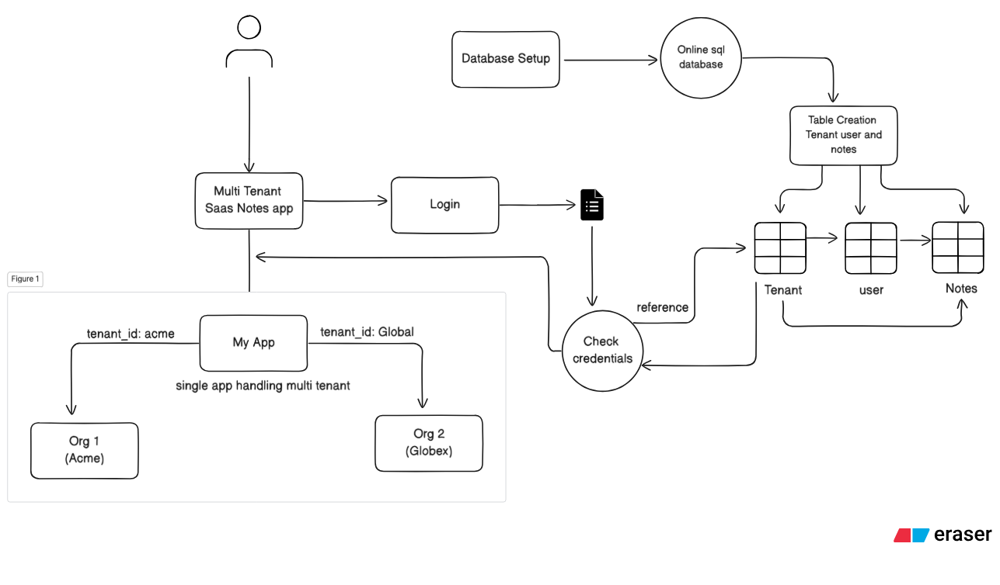
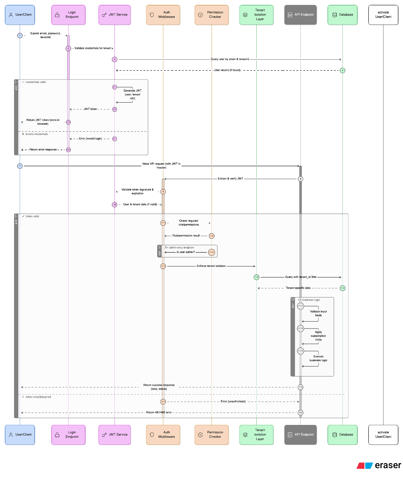

# Multi-Tenant Notes App

A modern, full-featured note-taking application built with a multi-tenant architecture, allowing multiple organizations (tenants) to use the service with complete data isolation and custom user management.




🚀 **Live Demo**: [https://multi-tenant-notes-app-fawn.vercel.app/](https://multi-tenant-notes-app-fawn.vercel.app/)

## Features

### Multi-Tenancy Architecture

Our application implements multi-tenancy using a **shared schema with tenant ID columns** approach:

- **Data Isolation**: Each tenant's data is securely separated through tenant ID foreign keys
- **API Security**: Middleware ensures users can only access their own tenant's data
- **Efficient Infrastructure**: Single database instance with logical separation of data
- **Scalable Design**: Built to support hundreds of independent organizations

Each database query automatically filters by tenant ID, making it impossible for data to leak between organizations.

### Security & Authentication

- **JWT Authentication**: Secure token-based authentication system
- **Role-Based Access Control**: Two clearly defined user roles:
  - **Admin**: Can manage organization settings, invite team members, and control subscription
  - **Member**: Can create and manage notes within permission boundaries
- **Middleware Protection**: API routes are protected by authentication and authorization middleware
- **Secure Password Handling**: Proper password hashing and security practices

### Test Accounts

Ready to try the application? Use these test accounts (all use password: `password`):

| Email           | Role   | Organization |
| --------------- | ------ | ------------ |
| admin@org1.test | Admin  | ORG1         |
| user@org1.test  | Member | ORG1         |
| admin@org2.test | Admin  | ORG2         |
| user@org2.test  | Member | ORG2         |

### Subscription Plans & Feature Gating

Our SaaS model offers tiered subscription plans with feature limitations:

- **Free Plan**:
  - Limited to 3 notes per organization
  - Perfect for small teams or testing
  - Core features available
- **Pro Plan**:
  - Unlimited notes
  - Enhanced feature set
  - Priority support
- **Seamless Upgrades**: Admins can upgrade with one click, instantly removing limitations
- **Graceful Degradation**: Clear UI indicators when limits are reached

## Architecture & Design Documents

Check out our architecture diagrams and design documents:

- [Application Architecture Diagram](https://app.eraser.io/workspace/9NqEGGzyY8wGCIjNRkAk?origin=share)
- [Database Schema & Entity Relationships](https://app.eraser.io/workspace/K35Ou4LV9sSeSXP99YOu?origin=share)

## Technical Stack

### Backend

- **Framework**: Next.js API Routes with App Router architecture
- **Database**: Supabase (PostgreSQL) for reliable, scalable data storage
- **Authentication**: Custom JWT implementation with secure token handling
- **API Design**: RESTful API endpoints with proper error handling
- **Middleware**: Custom authentication and role verification middleware
- **Security**: CORS support, input validation, and secure data practices

### Frontend

- **Framework**: React with Next.js for server and client components
- **State Management**: React Context API for auth state and data management
- **Styling**: Tailwind CSS for beautiful, responsive UI components
- **UX Design**: Intuitive interfaces with role-specific elements
- **Accessibility**: Semantic HTML and accessible UI components

## Getting Started

### Prerequisites

- Node.js 18+
- npm or yarn
- Supabase account (for database)

### Local Development Setup

1. **Clone the repository**

   ```bash
   git clone https://github.com/bhatia4404/MultiTenantNotesApp.git
   cd MultiTenantNotesApp
   ```

2. **Install dependencies**

   ```bash
   npm install
   # or
   yarn install
   ```

3. **Set up environment variables**

   Create a `.env` file in the root directory by copying the example file : `.env.example`

4. **Run the development server**

   ```bash
   npm run dev
   # or
   yarn dev
   ```

5. **Access the application**

   Open [http://localhost:3000](http://localhost:3000) in your browser.

### Database Setup

The application requires the following tables in Supabase:

- `tenants`: Organization data and subscription information
- `users`: User accounts with tenant associations
- `notes`: Notes with tenant and user relationships

A sample SQL schema is available in the `db` folder. You can run this schema in your Supabase SQL editor to set up the necessary tables.

## API Documentation

### Authentication Endpoints

- **Login**: `POST /api/auth/login`
  - Request body: `{ "email": "user@example.com", "password": "yourpassword" }`
  - Returns JWT token and user data

### Notes Endpoints

- **Get All Notes**: `GET /api/notes`

  - Returns all notes for the user's tenant (filtered by permissions)
  - Admin sees all notes, members see only their own

- **Create Note**: `POST /api/notes`

  - Request body: `{ "title": "Note Title", "content": "Note content..." }`
  - Creates new note in the user's tenant

- **Get Single Note**: `GET /api/notes/:id`

  - Returns specific note if user has permission

- **Update Note**: `PUT /api/notes/:id`

  - Request body: `{ "title": "Updated Title", "content": "Updated content..." }`
  - Updates note if user has permission

- **Delete Note**: `DELETE /api/notes/:id`
  - Deletes note if user has permission

### Tenant Management

- **Upgrade to Pro**: `POST /api/tenants/:slug/upgrade`

  - Upgrades tenant to Pro plan (admin only)
  - Removes note limit restriction

- **Downgrade to Free**: `POST /api/tenants/:slug/downgrade`
  - Downgrades tenant to Free plan (admin only)

### User Management

- **List Users**: `GET /api/users`

  - Returns all users in the tenant (admin only)

- **Invite User**: `POST /api/users`
  - Request body: `{ "name": "User Name", "email": "user@example.com", "role": "member" }`
  - Invites new user to the tenant (admin only)

### System Endpoints

- **Health Check**: `GET /api/health`
  - Returns `{ "status": "ok" }` if the system is running

## Deployment

This project is optimized for deployment on [Vercel](https://vercel.com/).

### Deploy Your Own Instance

1. **Fork the repository.**
2. **Create a Supabase project** and set up the database schema using the provided SQL file.
3. **Connect your forked repository to Vercel.**
4. **Add the environment variables** from your `.env.local` file to your Vercel project settings.
5. **Deploy!** Vercel will automatically build and deploy your application.

- **Production URL**: [https://multi-tenant-notes-app-fawn.vercel.app/](https://multi-tenant-notes-app-fawn.vercel.app/)

## Acknowledgements

- Built with Next.js 15, React, and Tailwind CSS
- Database powered by Supabase
- Architecture diagrams created with Eraser.io
- Deployed on Vercel
